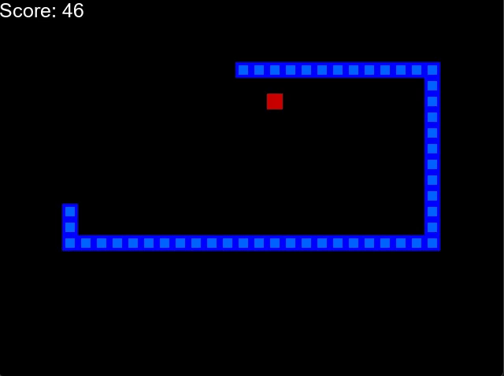
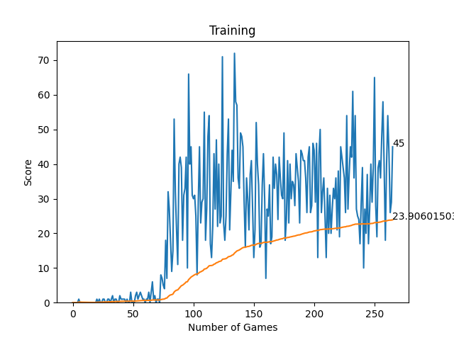

# 🐍 AI Learns to Play Snake

This project uses [Reinforcement Learning](https://en.wikipedia.org/wiki/Reinforcement_learning) to train an AI agent to play the classic Snake game. Built with Python using `PyGame` and `PyTorch`.

## 🎯 Objective
Train an AI agent to learn optimal movement strategies in a grid-based Snake game environment using Deep Q-Learning.

## 🧠 Tech Stack
- Python
- PyTorch
- NumPy
- PyGame
- Matplotlib
- IPython
- Anaconda

## 📈 Results
- After 300 games, the AI reaches an average score of 25.
- Demo GIF: 

## 📂 Project Structure

AI-Learns-to-Play-Snake
├── Figure_1.png
├── agent.py
├── arial.ttf
├── model.py
├── plotting.py
├── requirements.txt
├── README.md
├── snakeAI_demo.gif
└── snake_game.py

📊 Training Performance

🤖 How It Works
The AI observes the game state (snake position, food direction, danger).

Uses a Deep Q-Network (DQN) to select actions.

Learns through rewards: +10 for food, -10 for dying.

🙌 Acknowledgements
Inspired by freeCodeCamp’s Snake AI tutorial and RL research projects.
